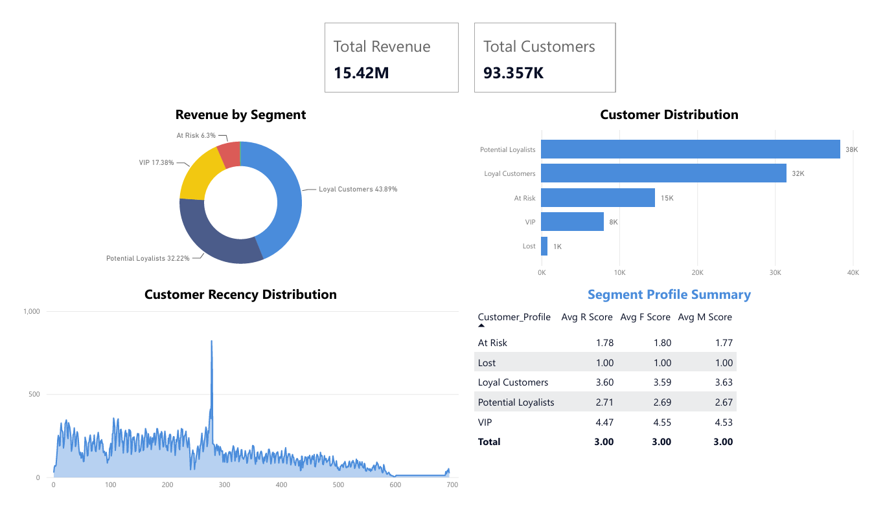

# 🛒 E-Commerce Customer Segmentation (RFM Analysis)

## 📌 Project Overview
In the highly competitive e-commerce sector, understanding customer behavior is crucial for maximizing retention and revenue. This project aims to analyze a real-world dataset from an e-commerce platform to segment customers based on their purchasing habits using **RFM (Recency, Frequency, Monetary)** analysis. 

The ultimate goal is to provide actionable business insights to the marketing team to target the right customers with the right campaigns, thereby optimizing marketing spend and boosting overall ROI.

## 🛠️ Tech Stack & Tools
* **Database Management:** SQLite (Simulating a real-world Data Warehouse environment)
* **Data Processing & Analysis:** Python (Pandas)
* **Data Visualization:** Power BI
* **Version Control:** Git & GitHub

## 🔄 The Data Pipeline (ETL Process)
1. **Extract:** Raw CSV files (Orders, Customers, Payments, Products) were loaded into a local **SQLite database** to simulate a production environment and handle memory efficiently.
2. **Transform:** 
   * Executed complex `SQL JOIN` queries to merge relevant tables and filter out incomplete or canceled orders (`order_status = 'delivered'`).
   * Fetched the data into a **Pandas DataFrame** for advanced preprocessing.
   * Calculated the RFM metrics:
     * **Recency:** Days since the last purchase.
     * **Frequency:** Total number of distinct orders.
     * **Monetary:** Total amount spent by the customer.
   * Applied statistical scoring (`pd.qcut`) to rank customers from 1 to 5 across all three metrics.
3. **Load:** The final structured dataset was exported to a clean `.csv` file, ready for BI consumption.

## 👥 Customer Segmentation Logic
Customers were grouped into 5 main business profiles based on their Total RFM Score (Range: 3 - 15):
* **VIP / Champions (13-15):** Best customers, bought most recently, most often, and are heavy spenders.
* **Loyal Customers (10-12):** Customers who buy on a regular basis.
* **Potential Loyalists (7-9):** Recent customers with average frequency, good potential for upselling.
* **At Risk (4-6):** Customers who used to buy frequently but haven't returned in a long time.
* **Lost (3):** Lowest recency, frequency, and monetary scores.

## 📊 Key Business Insights
* **The "Loyalty" Opportunity:** The 'Loyal Customers' and 'Potential Loyalists' segments represent a massive portion of the customer base (approx. 74%). Targeted retention campaigns here can significantly drive up total revenue.
* **Revenue Concentration:** A relatively small percentage of 'VIP' customers contributes heavily to the total revenue stream, highlighting the need for exclusive VIP reward programs.
* **Re-engagement Strategy:** A noticeable chunk of customers falls into the 'At Risk' category. Automated "We miss you" email campaigns with special discounts should be triggered to prevent churn.

## 📈 Dashboard Snapshot
An interactive Power BI dashboard was built to allow stakeholders to dynamically explore customer segments, revenue distributions, and recency trends.

*(Note: Ensure the image file is named `dashboard.png` and placed in the same directory as this README).*

## 👨‍💻 Author
**Beshoy Magdy Abdelsaid**
* Data Scientist / Data Analyst
* **LinkedIn:** [beshoy-magdy2050](https://www.linkedin.com/in/beshoy-magdy2050)
* **GitHub:** [beshomagdy2050](https://github.com/beshomagdy2050)
* **Email:** Beshoy.Magdy.Official@gmail.com
